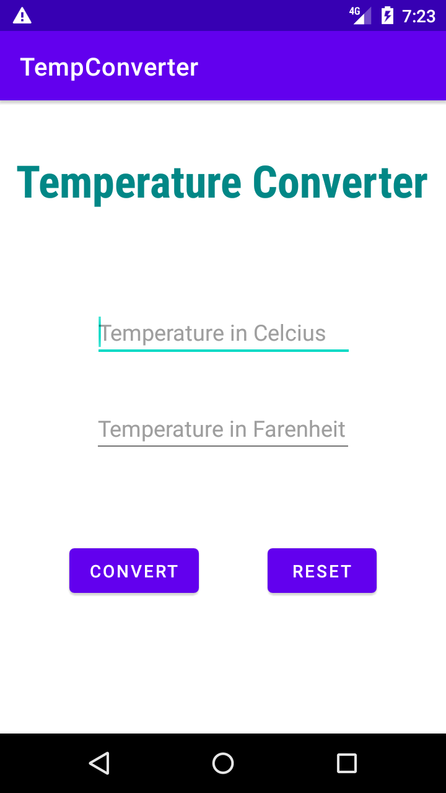
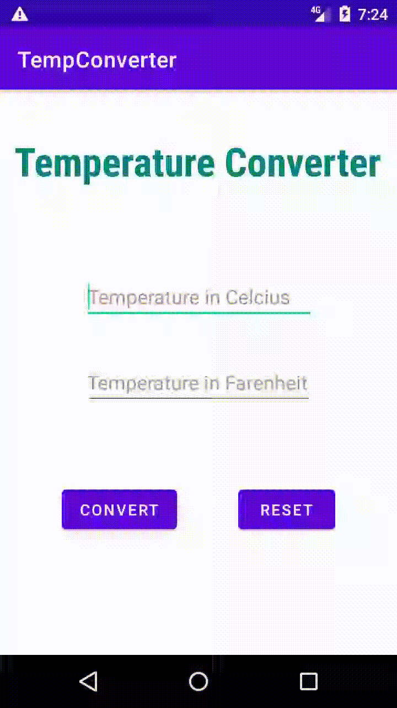

# **Tempconverter App**

## **Description:**
----------------------------
Temperature Converter (from Celsius to Fahrenheit and vice versa) using Android Studio and the Kotlin programming language.

## **Features:**
--------------------------

1. Converts temperature from Celsius to Fahrenheit
2. Converts temperature from Fahrenheit to Celsius
3. Clears the outcome with clear button

